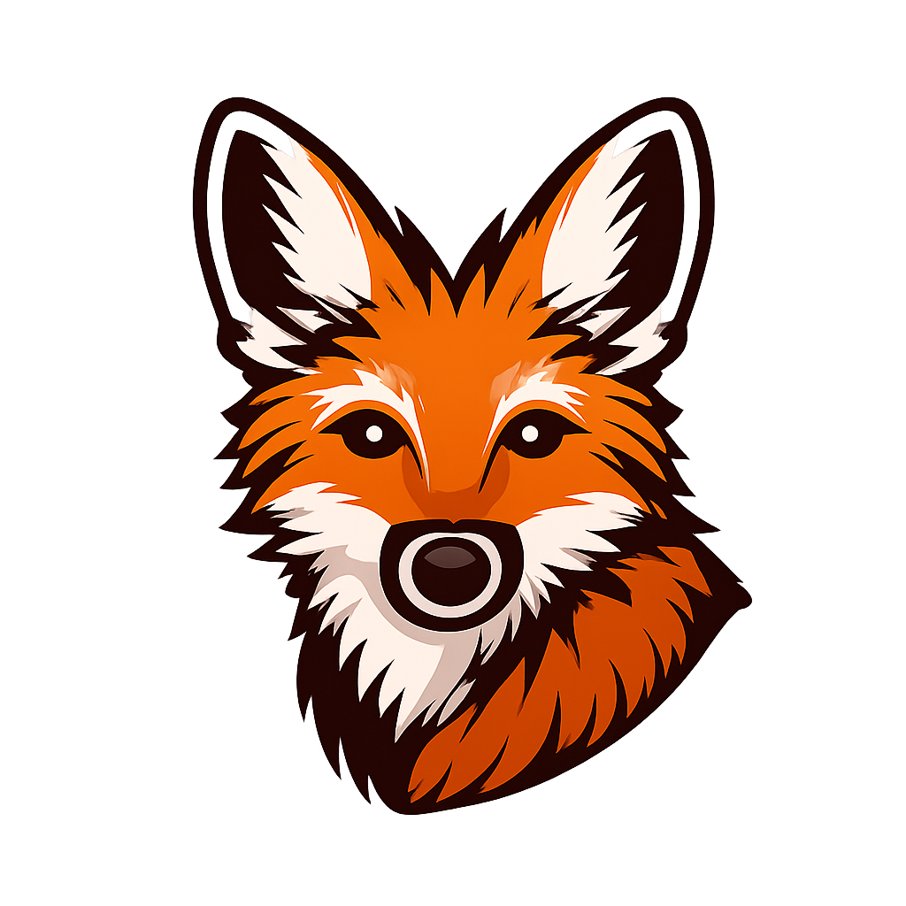

<div align="center">
  
  
  # Maned Scout
  
  **A modern, lightweight web interface for Apache Kafka cluster management**
  
  [](https://go.dev/)
  [](LICENSE)
  [](CONTRIBUTING.md)

</div>

---

## 📋 Table of Contents

- [Overview](#-overview)
- [Features](#-features)
- [Prerequisites](#-prerequisites)
- [Installation](#-installation)
- [Configuration](#-configuration)
- [Usage](#-usage)
- [Development](#-development)
- [Docker](#-docker)
- [Contributing](#-contributing)
- [License](#-license)

---

## 🚀 Overview

**Maned Scout** is a powerful, user-friendly web application for managing and monitoring Apache Kafka clusters. Built with Go and designed with simplicity and performance in mind, it provides a clean interface for visualizing cluster health, managing topics, monitoring consumer groups, and producing/consuming messages in real-time.

### Why Maned Scout?

- **🎯 Lightweight**: Minimal resource footprint with single binary deployment
- **⚡ Real-time**: WebSocket-powered message streaming
- **🎨 Modern UI**: Clean, responsive interface built with modern web technologies
- **🔌 Extensible**: Compatible with Kafka-compatible streaming platforms

---

## ✨ Features

### Cluster Management
- ✅ Multi-cluster support with dynamic configuration
- ✅ Real-time cluster health monitoring
- ✅ Broker metadata and statistics
- ✅ TLS/SSL and SASL authentication support
- ✅ AWS IAM authentication for MSK clusters

### Topic Management
- ✅ Create, update, and delete topics
- ✅ View topic configurations and partition details
- ✅ Increase partition counts
- ✅ Monitor topic-level metrics
- ✅ Internal topic filtering

### Message Operations
- ✅ Real-time message consumption via WebSocket
- ✅ Message production with custom keys and values
- ✅ Partition-level message viewing
- ✅ Offset and timestamp-based navigation

### Consumer Group Management
- ✅ List all consumer groups
- ✅ View consumer group details and lag
- ✅ Monitor member status and assignments
- ✅ Track consumer group states

### Additional Features
- 📊 Cluster statistics dashboard
- 🔄 Live configuration reloading (file-watch)
- 📝 Structured logging with charmbracelet/log
- 🎯 Cross-platform support (Windows, Linux, macOS)

---

## 📦 Prerequisites

- **Go** 1.25.4 or higher
- **Apache Kafka** (or compatible streaming platform)
- **Make** (optional, for build automation)
- **Docker & Docker Compose** (optional, for development environment)

---

## 🔧 Installation

### Option 1: Build from Source

```bash
# Clone the repository
git clone https://github.com/OliveiraNt/maned-scout.git
cd maned-scout

# Install templ (template engine)
go install github.com/a-h/templ/cmd/templ@latest

# Build the application
make build

# Run the application
./main
```

### Option 2: Using Go Install

```bash
go install github.com/OliveiraNt/maned-scout@latest
```

### Option 3: Docker

```bash
# Build and run with Docker
docker build -t maned-scout .
docker run -p 8080:8080 -v $(pwd)/config.yml:/app/config.yml maned-scout
```

---

## ⚙️ Configuration

### Configuration File

Maned Scout looks for `config.yml` in the following locations (in order):

1. `./config.yml` (current directory)
2. `$XDG_CONFIG_HOME/maned-scout/config.yml` (Linux/macOS)
3. `$HOME/.config/maned-scout/config.yml` (Linux/macOS)
4. `$HOME/.maned-scout/config.yml` (Linux/macOS)
5. `/etc/maned-scout/config.yml` (Linux/macOS)
6. `%APPDATA%\maned-scout\config.yml` (Windows)
7. `%PROGRAMDATA%\maned-scout\config.yml` (Windows)

You can also specify a custom path using the `MANED_SCOUT_CONFIG` environment variable.

### Example Configuration

```yaml
clusters:
  # Basic cluster (no authentication)
  - name: dev
    brokers:
      - localhost:9092

  # Cluster with TLS
  - name: production
    brokers:
      - kafka-1.example.com:9093
      - kafka-2.example.com:9093
    tls:
      enabled: true
      ca_file: /path/to/ca-cert.pem
      cert_file: /path/to/client-cert.pem
      key_file: /path/to/client-key.pem
      insecure_skip_verify: false

  # Cluster with SASL/SCRAM
  - name: staging
    brokers:
      - kafka.staging.example.com:9092
    sasl:
      mechanism: SCRAM-SHA-256
      username: admin
      password: secret

  # AWS MSK with IAM authentication
  - name: aws-msk
    brokers:
      - b-1.msk-cluster.kafka.us-east-1.amazonaws.com:9098
    aws:
      iam: true
      region: us-east-1
```

### Environment Variables

| Variable | Description | Default |
|----------|-------------|---------|
| `MANED_SCOUT_CONFIG` | Path to configuration file | (auto-detected) |
| `MANED_SCOUT_HTTP_PORT` | HTTP server port | `8080` |

---

## 🎯 Usage

### Starting the Server

```bash
# Start the application
make run

# Or run the binary directly
./main

# With custom port
MANED_SCOUT_HTTP_PORT=3000 ./main
```

The web interface will be available at `http://localhost:8080`

### Web Interface

Navigate to the web UI to:

1. **View Clusters**: See all configured clusters and their health status
2. **Manage Topics**: Create, configure, and delete topics
3. **Browse Messages**: View and search messages in topics
4. **Produce Messages**: Send messages to topics
5. **Monitor Consumer Groups**: Track consumer lag and group states

### API Usage

```bash
# List all clusters
curl http://localhost:8080/api/clusters

# List topics in a cluster
curl http://localhost:8080/api/clusters/dev/topics

# Get topic details
curl http://localhost:8080/api/clusters/dev/topics/my-topic

# Create a new topic
curl -X POST http://localhost:8080/api/clusters/dev/topics \
  -H "Content-Type: application/json" \
  -d '{
    "name": "new-topic",
    "num_partitions": 3,
    "replication_factor": 2
  }'

# Produce a message
curl -X POST http://localhost:8080/api/clusters/dev/topics/my-topic/messages \
  -H "Content-Type: application/json" \
  -d '{
    "key": "key1",
    "value": "Hello, Kafka!"
  }'
```

---

## 🛠️ Development

### Prerequisites for Development

```bash
# Install development tools
make templ-install

# Install air for live reloading (optional)
go install github.com/air-verse/air@latest
```

### Development Workflow

```bash
# Run with live reload
make watch

# Run tests
make test

# Build the application
make build

# Clean build artifacts
make clean
```

### Project Structure

```
maned-scout/
├── cmd/                      # Command-line entry points
│   └── web.go               # HTTP server initialization
├── internal/
│   ├── adapters/            # External interfaces (HTTP, etc.)
│   │   └── http/            # HTTP handlers and UI
│   │       ├── ui/          # Web UI assets and templates
│   │       ├── api_*.go     # REST API handlers
│   │       ├── ui_*.go      # UI page handlers
│   │       └── ws.go        # WebSocket handlers
│   ├── application/         # Application services (use cases)
│   │   ├── cluster_service.go
│   │   ├── topic_service.go
│   │   └── consumer_groups_service.go
│   ├── domain/              # Business logic and entities
│   │   ├── cluster.go
│   │   ├── topic.go
│   │   └── repository.go    # Repository interfaces
│   ├── infrastructure/      # External integrations
│   │   ├── kafka/           # Kafka client implementation
│   │   └── repository/      # Configuration repository
│   ├── config/              # Configuration handling
│   └── utils/               # Shared utilities
├── certs/                   # TLS certificates (for development)
├── config.yml               # Application configuration
├── docker-compose.yml       # Docker Compose setup
├── Dockerfile               # Container image definition
├── go.mod                   # Go module dependencies
└── main.go                  # Application entry point
```

### Running with Docker Compose

The project includes a `docker-compose.yml` for local Kafka development:

```bash
# Start Kafka brokers (plaintext and TLS)
make docker-run

# Stop Kafka brokers
make docker-down
```

This starts two Kafka brokers:
- **broker**: `localhost:9092` (plaintext)
- **broker-tls**: `localhost:9093` (TLS/SSL)

## 🐳 Docker

### Building the Image

```bash
docker build -t maned-scout:latest .
```

### Running with Docker

```bash
# Run with default configuration
docker run -p 8080:8080 \
  -v $(pwd)/config.yml:/app/config.yml \
  maned-scout:latest

# Run with environment variables
docker run -p 3000:3000 \
  -e MANED_SCOUT_HTTP_PORT=3000 \
  -e MANED_SCOUT_CONFIG=/app/config.yml \
  -v $(pwd)/config.yml:/app/config.yml \
  maned-scout:latest
```

### Docker Compose

```yaml
version: '3.8'
services:
  maned-scout:
    image: maned-scout:latest
    ports:
      - "8080:8080"
    volumes:
      - ./config.yml:/app/config.yml
    environment:
      - MANED_SCOUT_HTTP_PORT=8080
```

---

## 🤝 Contributing

Contributions are welcome! Please feel free to submit a Pull Request. For major changes, please open an issue first to discuss what you would like to change.

### Development Guidelines

1. Fork the repository
2. Create your feature branch (`git checkout -b feature/AmazingFeature`)
3. Commit your changes (`git commit -m 'Add some AmazingFeature'`)
4. Push to the branch (`git push origin feature/AmazingFeature`)
5. Open a Pull Request

### Code Standards

- Follow Go best practices and idioms
- Write tests for new features
- Update documentation as needed
- Run `go fmt` before committing
- Ensure all tests pass (`make test`)

---

## 📄 License

This project is licensed under the MIT License - see the [LICENSE](LICENSE) file for details.

---

## 🙏 Acknowledgments

- [franz-go](https://github.com/twmb/franz-go) - Excellent Kafka client library
- [templ](https://github.com/a-h/templ) - Type-safe Go templating
- [chi](https://github.com/go-chi/chi) - Lightweight HTTP router
- Inspired by [AKHQ](https://akhq.io/), [Kafka UI](https://github.com/provectus/kafka-ui), and [Redpanda Console](https://github.com/redpanda-data/console)

---

## 📞 Support

- **Issues**: [GitHub Issues](https://github.com/OliveiraNt/maned-scout/issues)
- **Discussions**: [GitHub Discussions](https://github.com/OliveiraNt/maned-scout/discussions)

---

<div align="center">
  Made with ❤️ by the Maned Scout team
  <br>
  <sub>Named after the Maned Wolf (Chrysocyon brachyurus), a majestic South American canid</sub>
</div>

